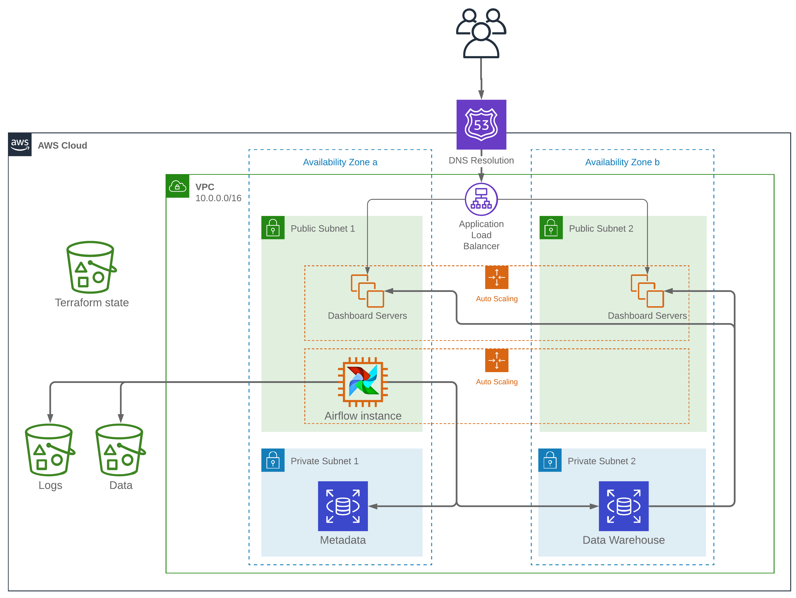

# Finance Scraper

## Table of contents
1. [Description](README.md#description)
2. [AWS infrastructure](README.md#aws-infrastructure)
3. [General prerequisites](README.md#general-prerequisites)
4. [Local installation](README.md#local-installation)
5. [Cloud installation](README.md#cloud-installation)
6. [Warning](README.md#warning)

## Description
This repository contains a Extract-Transform-Load (ETL) pipeline which extracts security data details from pages on morningstar.fr (see [an example here](http://tools.morningstar.fr/fr/stockreport/default.aspx?Site=fr&id=0P0001A178&LanguageId=fr-FR&SecurityToken=0P0001A178]3]0]E0WWE$$ALL,DREXG$XHEL,DREXG$XLON,DREXG$XNYS)). The data is saved in a SQL database and feeds a web dashboard displaying graphs and tables.
The steps of the pipeline are:
* extract: scrape web pages and save them raw on AWS S3.
* transform: parse raw web pages and store the results in a CSV file, then store in S3.
* load: copy the CSV file into a PostgresSQL database.

The pipeline can be run locally and load data in a database provided by the user, or in the Amazon Web Services cloud on an infrastructure built automatically by this software.

## AWS infrastructure
The AWS infrastructure provisioned here is compatible with the free-tier, and should cost you a minimal amount of money once you finish your free-tier allowance.
The infrastructure is managed with Terraform and composed of the following elements (see picture below):
* an EC2 instance running Apache Airflow with a Local Executor, belonging to an autoscaling group maintains a single running Airflow instance at all times.
* a data warehouse consisting of an RDS instance running the PostgresSQL engine
* a metadata database to store Airflow tasks status on a PostgresSQL RDS instance.
* S3 buckets to store the Terraform state files, the scraped data, and the Airflow logs
* EC2 instances serving the data dashboard and running a Dash + gunicorn + nginx stack, belonging to an autoscaling group which scales in and out based on CPU usage

## General prerequisites
* this software is designed to work on a Linux distribution.
* Python 3.6 or a higher version is required.
* you need to provide a file containing a list of URLs to scrape (one URL per line, see an example URL in the description paragraph). Name this file `scraping_links.txt` and place it in folder `finance_scraping` (where the `main.py` module is located).

## Local installation
### Prerequisites
The following packages are will be installed along with `finance-scraping`:
* requests >= 2.22
* BeautifulSoup4 >= 4.7.1
* psycopg2 >= 2.8

You need to install PostgresSQL, and create a database to load data into. Take note of the user name and password with write privileges to this database, as you will need these during the configuration of `finance-scraping`.

### Running tests

Unit tests can be run by going to the `tests` folder at the root of the repository and by running `run_tests.sh`. This will output a coverage report to the console.

### Installation and configuration
* Run `pip install finance-scraping`.
* Run `finance-scraper --local-config` to set the configuration of the scraper. You will be prompted to enter configuration values, which are saved in `~/.bashrc`.

### How to run
To run the entire ETL pipeline, run `finance-scraper -etl`. You can also run `finance-scraper` with any of the optional arguments `-e`, `-t` or `-l` to run an individual step. It is possible to specify the date parameter `-d` with `-t` and/or `-l` to process data scraped on a specific date. For more information run help with `finance-scraper -h`.

### Schedule runs with Apache Airflow
* Read the [Airflow documentation](https://airflow.apache.org/index.html) to install and configure Airflow for your system.
* Amend the file `finance_scraping_dag.py` from the `finance_scraping` folder with your scheduling preferences and copy it into the `dags` folder of your Airflow installation before starting the scheduler.

## Cloud installation
### Prerequisites
If you do not have an AWS account, create one [here](https://aws.amazon.com/console). Create a user with administrator permissions that Terraform will use to build the infrastructure by following these [instructions](https://docs.aws.amazon.com/mediapackage/latest/ug/setting-up-create-iam-user.html). Install the AWS command-line interface by running `pip install aws-cli` and configure it according to the [documentation](https://docs.aws.amazon.com/cli/latest/userguide/cli-chap-configure.html).

Install [Terraform 0.12](https://learn.hashicorp.com/terraform/getting-started/install.html).

You should also have a registered domain name where to host your website. You will provide the domain name during the configuration of the infrastructure.

### Installation and configuration
Run `pip install finance-scraping` to install the software. Run `finance-scraper --configure` to start the configuration wizard, your input will be required on the command line. Parameters will be displayed one by one with the current value shown between brackets (empty brackets indicated the absence of value). It is required to provide a value for all parameters. The parameters are:
* aws_profile: the AWS user Terraform should assume to build the infrastructure.
* region: the AWS region where to build the infrastructure.
* user_agent: the User-Agent to use when scraping web pages. It is recommended to provide your email address so that the website administrator can contact you if there is a problem. If you want to include spaces, put the value to this parameter between quotes.
* max_retries: the maximum number of times the web scraper should retry a page when the request fails. 10 is an acceptable value.
* backoff_factor: factor to calculate delay times to apply when the request receives an error. 0.3 is an acceptable value. Learn more [here](https://urllib3.readthedocs.io/en/latest/reference/urllib3.util.html#module-urllib3.util.retry).
* retry_on: comma-separated HTTP status codes that trigger a new request. An acceptable value is 500,502,503,504.
* timeout: timeout for the request in seconds. An acceptable value is 20.
* db_username: username to use when setting up the database.
* db_password: password to use when setting up the database.
* domain_name: the name of your website domain

### Building the infrastructure
Run `finance-scraper --build` to build the infrastructure in AWS, then provisioning of the AWS infrastructure will start. It takes between 10 and 15 minutes for the process to start provisioning the web server. At this point you will see that Terraform is creating a resourced called `aws_acm_certificate_validation`. This means your nameserver records have been created in AWS Route53 and the SSH certificate is being validated. In order for validation to succeed, you need to update the nameserver records in your domain registrar: copy their URL from Route53 and paste it in the domain registrar. DNS validation usually takes under 40 minutes but can take several hours. If Terraform times out, simply rerun `finance-scraper --build`.

The server hosting the dashboard will not be available until the ETL pipeline has run at least one time, so you will find an error if you try to access your website before ETL has run.

### Monitoring your infrastructure
Finance scraper does not provide any special tools to monitor your infrastructure, a good next step for this repository is to install the AWS Cloudwatch agent on every instance and send system logs to Cloudwatch Logs. When provisioning is done, you can take note of the public IP of the EC2 instance running Airflow on the AWS console and check the Airflow dashboard on port 8080. You can SSH into instance using the key `airflow-instance-ssh` located in your `~/.ssh` folder.

### Destroying the infrastructure
The whole infrastructure can be destroyed by running `finance-scraper --nuke`.

## Warning
Do not modify the configuration files manually (`.terraform` folders, `terraform.tfstate` files and `~/.terraform_env_vars` file). This will break your installation and require painful cleaning.

Be responsible when web scraping, and do not put a high burden on web servers by requesting a lot of pages in a short amount of time. It makes the job of maintaining webservers hard and you could be banned from accessing the website.

You are responsible for the costs incurred by your own AWS infrastructure. You should understand how AWS services are priced and know how much the infrastructure deployed by Finance Scraper could cost you if you run out of free-tier allocation. Apart from the documentation, AWS has a [tool to help you estimate your bills](https://calculator.s3.amazonaws.com/index.html).
